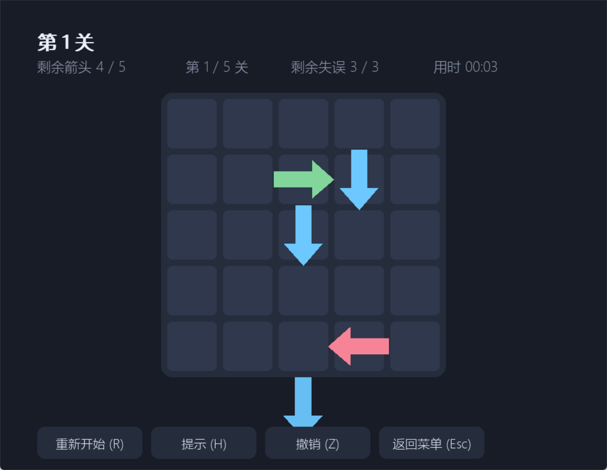
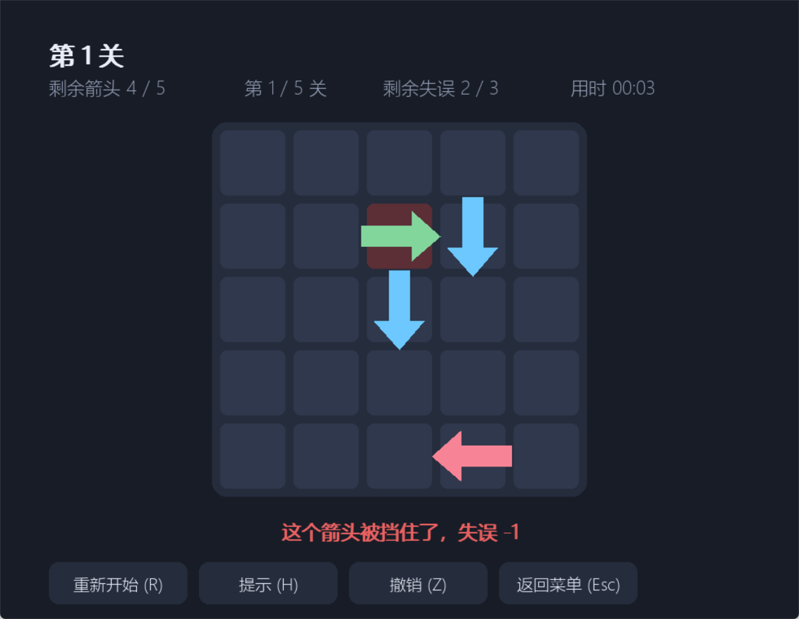
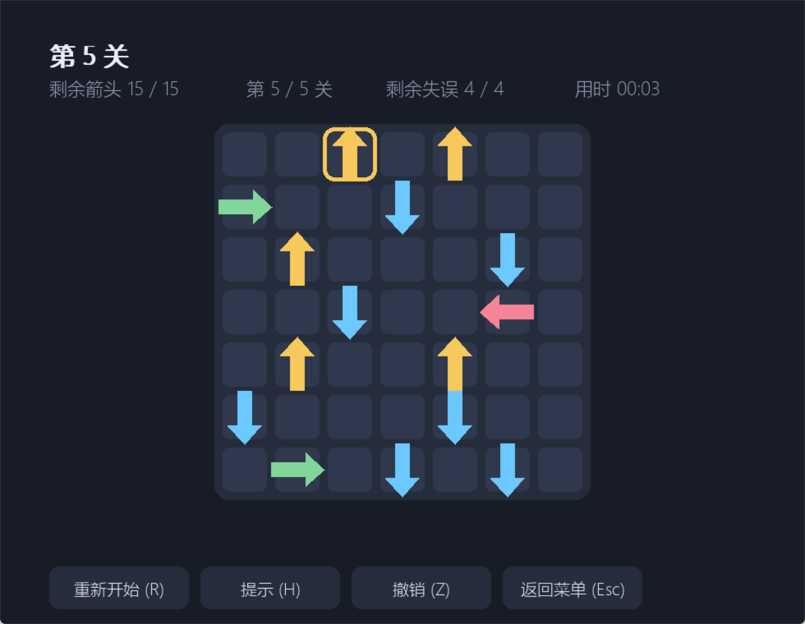

# 一箭又一箭

用 Python + pygame 写的点击式箭头解谜小游戏。点掉能飞出棋盘的箭头，把箭头全部清空即可过关。

## 游戏简介

棋盘上有若干朝上 / 下 / 左 / 右的箭头。点击一个箭头后，程序检查它前进方向上（同一行或同一列、箭头与棋盘边界之间）是否还有别的箭头：

- 前方没有箭头挡路：箭头飞出棋盘并消失
- 前方有箭头挡路：箭头飞不出去，会晃动、变红并给出文字提示，失误次数减 1

清空本关全部箭头即通关，失误次数用完则本关失败，可以重新开始。共 5 关，均已验证存在通关顺序。

## 开发环境

- Windows 10 / 11
- Python 3.11（本地 `D:\python-3`）
- pygame 2.6.1

## 安装与运行

```bash
pip install -r requirements.txt
python main.py
```

## 操作说明

| 操作 | 说明 |
| --- | --- |
| 鼠标左键点击箭头 | 让箭头尝试飞出棋盘 |
| 重新开始 / `R` | 本关恢复初始布局，失误次数重置 |
| 提示 / `H` | 用求解器找出一个能安全飞出的箭头并高亮 |
| 撤销 / `Z` | 收回上一步飞出的箭头 |
| 返回菜单 / `Esc` | 回到开始界面 |
| `Enter` | 通关后进入下一关 |

## 游戏截图

| 开始界面 | 游戏界面（第 1 关） |
| --- | --- |
|  |  |

| 箭头飞出棋盘 | 被挡住时的晃动与失误提示 |
| --- | --- |
|  |  |

| 第 5 关（7×7）与提示功能 | 通关界面 | 失败界面 |
| --- | --- | --- |
|  |  |  |

## 关卡

| 关卡 | 棋盘 | 箭头数 | 失误次数 |
| --- | --- | --- | --- |
| 第 1 关 | 5 × 5 | 5 | 3 |
| 第 2 关 | 5 × 5 | 7 | 3 |
| 第 3 关 | 6 × 6 | 10 | 3 |
| 第 4 关 | 6 × 6 | 13 | 3 |
| 第 5 关 | 7 × 7 | 15 | 4 |

每一关的可行通关顺序见 [`docs/solutions.md`](docs/solutions.md)。

## 项目结构

```
main.py            游戏主程序：界面、动画、按钮
logic.py           核心逻辑：行/列有序坐标表 + 二分判空、点击判定、失误与撤销
levels.py          关卡数据（^ 上 v 下 < 左 > 右，. 空格）
solver.py          求解器：位掩码状态压缩 + 记忆化搜索、解数量统计
tests/test_logic.py  自动化测试（15 项，覆盖 T01-T15）
tools/             关卡生成/校验/难度分析、自动截图脚本
screenshots/       运行截图与演示 GIF
```

## 测试

```bash
python -m unittest discover -s tests -v
```

15 项测试全部通过，覆盖作业要求的 T01-T06（含边缘箭头越界检查），并额外校验四个方向阻挡、点击坐标换算、按钮交互、二分判空与线性扫描等价、求解器结果可回放、解数量统计、无解关卡识别，以及 5 个关卡都能通关。

## 说明

- 界面元素全部用代码绘制，不依赖图片素材。
- 关卡先用 `tools/gen_levels.py` 随机生成候选（按"消除顺序的逆序"摆放，天然有解），再人工挑选调整，最后用 `tools/check_levels.py` 确认可通关。
- `tools/analyze_levels.py` 输出每关的难度指标（初始可飞出数、通关顺序总数、求解搜索过的局面数）。
- 截图由 `tools/run_demo_shots.ps1` 自动驱动界面生成，演示 GIF 由帧渲染 + Pillow 合成。
