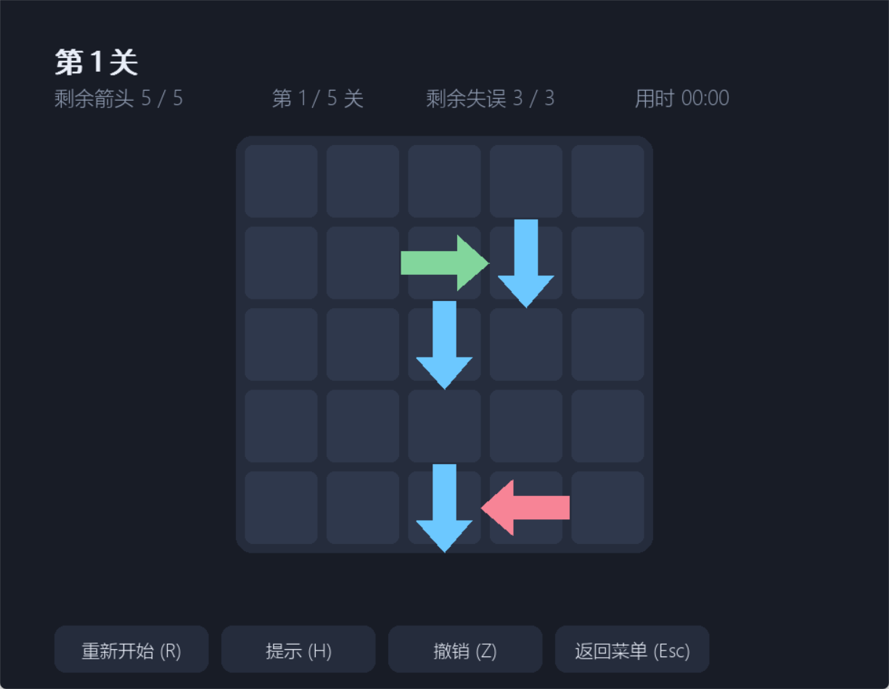
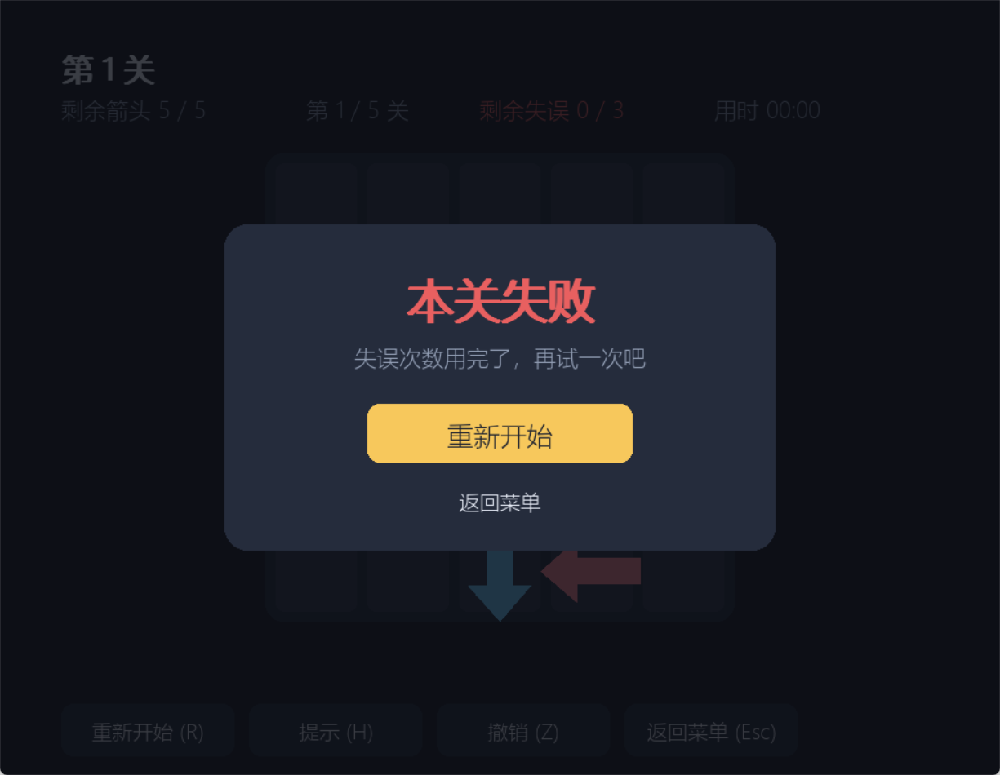

# 一箭又一箭 —— Python + AIGC 小游戏开发

| 项目 | 内容 |
| --- | --- |
| 这个作业属于哪个课程 | <课程链接> |
| 这个作业要求在哪里 | <作业链接> |
| 这个作业的目标 | 使用 Python 和 AIGC 完成"一箭又一箭"小游戏 |
| 学号 | XXXXXXXX |
| GitHub 仓库 | https://github.com/otto2-5-8/one-arrow-after-another |

## 一、项目展示

| 开始界面 | 游戏界面 | 通关界面 | 失败界面 |
| --- | --- | --- | --- |
|  |  |  |  |

箭头飞出棋盘、被挡住时的晃动反馈、提示功能分别见仓库 `screenshots/03_flying.png`、`04_blocked.png`、`05_level5_hint.png`。

## 二、项目介绍

### 2.1 游戏规则

棋盘上每个箭头朝上、下、左、右之一。点击箭头后沿它朝着的方向看：一路到棋盘边界都没有别的箭头，箭头就飞出棋盘并消失；路上还有别的箭头则飞不出去，箭头会晃动变红并给出文字提示，失误次数减 1。清空本关全部箭头即通关，失误次数用完本关失败。共 5 关（5×5 到 7×7），每关失误次数 3～4 次。

### 2.2 界面设计

- 开始界面：标题、开始游戏按钮、关卡选择（未解锁的关卡置灰）和已解锁进度。
- 游戏界面：顶部显示当前关卡、剩余箭头、剩余失误和用时，中间是棋盘，底部是重新开始、提示、撤销、返回菜单四个按钮。
- 结果界面：通关面板显示本关用时与失误次数，并提供"下一关"；失败面板提供"重新开始"。

## 三、主要功能与特色

### 3.1 鼠标点击操作

点击事件先在按钮上做命中检测，再换算成棋盘格子：`(x - 棋盘原点 - 间隙) // (格宽 + 间隙)` 得到列、同样方法得到行，最后用 `collidepoint` 排除格子之间的缝隙，所以点在缝隙上不会误判成点击箭头。

### 3.2 四种箭头方向

方向用 `^` `v` `<` `>` 四个字符表示，配合方向向量表 `DIRS`。画箭头时先定义"朝上"的一组多边形顶点，再按 0/90/180/270 度旋转，四种方向共用同一套绘制代码。

### 3.3 箭头飞出动画

点击能飞出的箭头时，把它加入 `flyers` 列表，每帧按方向位移（约 1500 px/s）并逐渐降低透明度，飞出窗口后回收，视觉上就是"飞出去了"。

### 3.4 碰撞反馈与失误

被挡住的箭头所在格子记一个抖动计时（0.45 s），绘制时用 `sin` 左右晃动 ±9 像素并把格子底色变红，同时在底部弹出"这个箭头被挡住了，失误 -1"；失误归零时提示"失误次数用完了！"并弹出失败面板。

### 3.5 扩展功能

在基础玩法之外做了：关卡解锁（过关后解锁下一关）、本关计时、提示（求解器给出一个安全着法并高亮该箭头）、撤销（收回上一步飞出的箭头）。

## 四、实现思路

### 4.1 棋盘与箭头表示

棋盘是一个字典 `{(行, 列): 方向}`，行数列数由关卡数据推出。箭头位置就是字典的键，因此"这一格有没有箭头"是 O(1) 判断，清掉箭头就是删除键。

### 4.2 关卡表示

关卡直接写成字符串数组，一个字符一格，`.` 表示空格：

```python
LEVELS = [{"name": "第 1 关", "mistakes": 3,
           "grid": [".....", "..>v.", "..v..", ".....", "..v<."]}]
```

5 个关卡都用 `solver.py` 的求解器验证过可以通关，具体通关顺序见仓库 `docs/solutions.md`。

### 4.3 状态机与帧循环

界面用 `scene`（menu / game）加 `overlay`（win / lose）两个状态控制，结果面板延后 0.9 秒再弹出，等飞出动画先播完；帧循环里把单帧时间限制在 0.1 秒以内（`dt = min(clock.tick(60) / 1000, 0.1)`），避免启动时字体预加载的卡顿让动画跳一下。

### 4.4 求解器：位掩码 + 记忆化搜索

"这一关到底能不能过、有多少种过法"由 `solver.py` 算。做法是状态压缩：给每个箭头分配一位二进制编号，并预先算出 `blocks[i]`——第 i 个箭头射线上有哪些箭头。这样"它现在能不能飞出"就退化成一次按位与：

```python
# solver.py:43-45
def moves(mask, blocks):
    """当前局面下所有能飞出的箭头下标。"""
    return [i for i, block in enumerate(blocks) if mask >> i & 1 and not block & mask]
```

搜索用记忆化，但 `memo` 里只存"这个局面选哪一步能赢"，最后沿 memo 回溯还原完整顺序，避免给每个局面都复制一整条路径：

```python
# solver.py:53-64
def dfs(state):
    if state == 0:
        return True
    if state in memo:
        return memo[state] >= 0
    visits[0] += 1
    for i in moves(state, blocks):
        if dfs(state ^ (1 << i)):
            memo[state] = i
            return True
    memo[state] = -1
    return False
```

同一套 `moves` 还能直接改成记忆化计数，数出这一关有多少种通关顺序（`ways(局面) = Σ ways(去掉一个可行箭头后的局面)`，`ways(空盘) = 1`）：

```python
# solver.py:81-88
def ways(state):
    if state in memo:
        return memo[state]
    total = 0
    for i in moves(state, blocks):
        total += ways(state ^ (1 << i))
    memo[state] = total
    return total
```

### 4.5 难度指标（`tools/analyze_levels.py` 实测）

| 关卡 | 棋盘 | 箭头数 | 初始可飞出 | 通关顺序总数 | 搜索过的局面数 |
| --- | --- | --- | --- | --- | --- |
| 第 1 关 | 5 × 5 | 5 | 1 | 4 | 5 |
| 第 2 关 | 5 × 5 | 7 | 5 | 1260 | 7 |
| 第 3 关 | 6 × 6 | 10 | 4 | 18900 | 10 |
| 第 4 关 | 6 × 6 | 13 | 6 | 10090080 | 13 |
| 第 5 关 | 7 × 7 | 15 | 8 | 3640536900 | 15 |

第 1 关一开始只有 1 个箭头能飞出，属于"找唯一着法"的教学关；第 4、5 关可选顺序上千万条，难度主要来自"看错哪根箭头能飞出"（棋盘大、箭头多，而失误次数只有 3～4 次）。另一个有意思的数据是：因为解很充足，记忆化搜索只探索了 5～15 个局面就找到了通解，连第 5 关 36 亿条顺序的精确计数也只花了几毫秒——位掩码把局面变成一个整数、memo 又只存一步，所以状态开销很低。

## 五、重点：路径检测方法

### 5.1 检测思路

最直观的做法是"从箭头出发沿方向一格一格走"（线性扫描）。实现时换成了更省的做法：给**每一行、每一列各维护一张升序坐标表**，判断某个箭头能不能飞出，只要在它所在行（或列）的升序表里二分出它自己的位置，再看它前面还有没有元素——落在表头/表尾就说明一路到边界都没有箭头。上下左右只是"往前"的方向不同，所以四个方向仍然共用同一段代码。

### 5.2 核心代码

```python
# logic.py:54-66
def is_free(self, pos):
    """箭头到棋盘边界之间没有其它箭头时返回 True。"""
    dr, dc = DIRS[self.arrows[pos]]
    r, c = pos
    if dr == 0:
        line = self.row_cols[r]
        forward = dc > 0
        index = bisect.bisect_right(line, c) if forward else bisect.bisect_left(line, c)
    else:
        line = self.col_rows[c]
        forward = dr > 0
        index = bisect.bisect_right(line, r) if forward else bisect.bisect_left(line, r)
    return index == len(line) if forward else index == 0
```

### 5.3 示例

```
→  ·  ·  ↑  ·     第 1 个箭头在 (1,1) 朝右，射线经过 (1,2)、(1,3) 会遇到 (1,4) 的 ↑，被挡住
↑  ·  ·  ·  →     第 5 个箭头在 (2,5) 朝右，右侧直接到边界，可以飞出
```

### 5.4 算法特点

**① 四个方向统一处理**：方向只体现在一张方向表里，检测代码完全不区分上、下、左、右，以后加方向也不用改逻辑。

```python
# logic.py:9
DIRS = {"^": (-1, 0), "v": (1, 0), "<": (0, -1), ">": (0, 1)}
```

画箭头同样只有一套代码：只定义一次"朝上"的多边形顶点，再按角度旋转出四个方向。

```python
# main.py:54 / main.py:71-72
ARROW_ANGLE = {"^": 0, ">": 90, "v": 180, "<": 270}

def arrow_points(cx, cy, size, direction):
    angle = math.radians(ARROW_ANGLE[direction])   # 四种方向共用同一组顶点
```

**② 判空只要 O(log n)**：把"沿射线走一遍"换成"在同一行（或列）的升序坐标表里二分"，棋盘变大也不会退化。

```python
# logic.py:58-61
if dr == 0:
    line = self.row_cols[r]
    forward = dc > 0
    index = bisect.bisect_right(line, c) if forward else bisect.bisect_left(line, c)
```

**③ 边界安全**：二分位置和表长（或 0）比较，就等价于"一路到边界都没有箭头"，不需要下标访问棋盘，也就不会越界。

```python
# logic.py:66
return index == len(line) if forward else index == 0
```

**④ 有序表与棋盘严格同步**：放回箭头用 `insort` 保持有序，所以 `undo` 撤回一步后坐标表依然正确。

```python
# logic.py:38-39
bisect.insort(self.row_cols.setdefault(r, []), c)
bisect.insort(self.col_rows.setdefault(c, []), r)
```

**⑤ 只依赖"当前还在棋盘上的箭头"**：拿走箭头时同时把它从两个有序表里删掉，表里永远只有剩余箭头；所以前面的箭头清空后，原来被挡住的箭头下一次二分就落到表头/表尾，自动变成可以飞出。

```python
# logic.py:44-46
del self.arrows[pos]
cols = self.row_cols[r]
cols.pop(bisect.bisect_left(cols, c))
```

## 六、AIGC 使用过程

| 子任务 | 借助何种 AIGC 技术 | AI 实现或提供了什么 | 效果如何 | 人工修改 |
| --- | --- | --- | --- | --- |
| 路径检测与求解器 | AIGC 编程助手（DeepSeek） | 四个方向的检测代码、记忆化搜索求解器、关卡校验脚本 | 求解器把"整局布局"当成"当前局面"判断阻挡，导致校验误报无解 | 改成 `free_in(state, dirs, ...)`：用当前剩余箭头判断阻挡、用原始布局查方向，恢复正常 |
| 关卡设计 | AIGC 编程助手（DeepSeek） | 随机生成"逆序摆放"的可解关卡候选 | 候选偏乱，人工挑选调整后第 5 关出现两处互相挡死的死局，无法通关 | 把两处箭头方向改掉，`tools/check_levels.py` 重新验证 5 关全可解 |
| 界面与动画 | AIGC 编程助手（DeepSeek） | pygame 界面框架、箭头绘制、飞出与晃动动画 | 能跑但运行即崩：`AttributeError: hint_timer`（新加的属性没在 `__init__` 初始化）；首帧 `dt` 含字体预加载耗时，动画和计时会跳一下 | 补上初始化；把 `dt` 限制在 0.1 秒内，并缓存字体路径加快启动 |
| 测试与截图 | AIGC 编程助手（DeepSeek） | T01-T06 测试用例、按剧本驱动界面的自动截图脚本 | 有两条用例的期望值写错：一条漏看了另一个箭头挡住了路径，一条把"能飞出的格子"记错（那一格其实被右边的箭头挡着）；截图脚本也遇到抓图偏移、窗口被遮挡、提示过期 | 核对路径检测结果后改对用例（现在 11 项全过）；截图脚本逐项修好（DPI 感知、窗口置顶、持续触发提示） |

## 七、测试结果

### 7.1 自动化测试

```bash
python -m unittest discover -s tests -v
```

共 15 项测试全部通过，包含作业要求的 T01-T06，以及四个方向阻挡、点击坐标换算、按钮交互、二分判空与线性扫描等价、位掩码解可回放、解数量统计、无解关卡识别、5 个关卡均可通关等补充用例。

### 7.2 测试记录

| 测试编号 | 测试项目 | 预期结果 | 实际结果 | 是否通过 |
| --- | --- | --- | --- | --- |
| T01 | 点击前方无阻挡的箭头 | 箭头飞出棋盘并消失 | 剩余箭头 2→1，失误不变 | 通过 |
| T02 | 点击前方有阻挡的箭头 | 箭头不消失，失误次数减 1 | 返回 blocked，失误 3→2 | 通过 |
| T03 | 点击位于边缘且朝向棋盘外的箭头 | 正常消失，不发生越界错误 | 四个方向边缘箭头均正常飞出 | 通过 |
| T04 | 消除本关全部箭头 | 显示通关并进入下一关 | 通关面板出现，解锁第 2 关，可切到第 2 关 | 通过 |
| T05 | 失误次数耗尽 | 显示失败并允许重新开始 | result=lose，失败面板显示，可重新开始 | 通过 |
| T06 | 游戏进行中重新开始 | 箭头布局和失误次数恢复 | 箭头恢复 5 个，失误恢复 3 次，用时清零 | 通过 |
| T07 | 点击格子之间的缝隙 | 不触发任何判定 | 失误次数不变 | 通过 |
| T08 | 点击"提示"按钮 | 高亮一个能飞出的箭头 | 高亮框出现在可飞出的箭头上 | 通过 |
| T09 | 点击"撤销"按钮 | 上一步飞出的箭头回到棋盘 | 箭头回到原位，剩余数量恢复 | 通过 |
| T10 | 5 个关卡是否都能通关 | 每关都有可通关顺序 | 求解器给出完整顺序，逐关回放每一步都合法并清空棋盘 | 通过 |
| T11 | 干净检出后运行（git archive 解压） | 测试通过、程序可跑 | 15 项测试通过，第 1 关可以通到底 | 通过 |
| T12 | 二分判空与线性扫描是否一致 | 两种实现结果相同 | 5 个关卡逐局面比对，结果全部一致 | 通过 |
| T13 | 求解器给出的顺序能否真的走通 | 按顺序点击可清空棋盘 | 5 关逐步回放，每步都合法并清空 | 通过 |
| T14 | 通关顺序总数统计是否正确 | 3 个互不干扰的箭头应为 6 种 | 实测 6 种；5 个关卡都 ≥ 1 | 通过 |
| T15 | 无解关卡能否被识别 | 判为无解、顺序数为 0 | 互堵关卡返回 None、计数 0 | 通过 |

## 八、PSP 项目计划与实际耗时

| 任务 | 预估耗时（小时） | 实际耗时（小时） | 差异（小时） |
| --- | --- | --- | --- |
| 需求分析与游戏设计 | 2.0 | 1.5 | -0.5 |
| Python 与图形库学习 | 3.0 | 2.0 | -1.0 |
| 游戏界面实现 | 4.0 | 5.0 | +1.0 |
| 路径与碰撞逻辑实现 | 3.0 | 3.5 | +0.5 |
| 关卡设计 | 2.0 | 1.5 | -0.5 |
| AIGC 辅助开发 | 3.0 | 4.0 | +1.0 |
| 测试与修改 | 2.0 | 3.0 | +1.0 |
| README 与博客撰写 | 2.0 | 1.5 | -0.5 |
| 合计 | 21.0 | 22.0 | +1.0 |

**PSP 分析**：AIGC 明显压缩了"学图形库"和"写框架"的时间，实际耗时反而多花在界面、测试和算法上——动画参数（飞出速度、抖动幅度、面板出现时机）要反复试，自动截图脚本调了不少次，后来又额外花了时间把判空改成二分、把求解器改成位掩码记忆化搜索并加上解数量统计；此外 AI 生成的代码不能直接用，求解器、关卡死局、属性初始化这几处都是自己跑起来才发现并修掉的。

## 九、项目特色

1. **规则简单**：一句话能说清，点掉能飞出去的箭头就行。
2. **四方向统一处理**：检测和绘制都只用一套代码，靠方向向量和角度旋转区分四个方向，扩展新方向不需要改逻辑。
3. **数据与显示分离**：`logic.py` 完全不依赖 pygame，可以单独跑测试；`main.py` 只负责显示和交互。
4. **有基本动画与完整反馈**：飞出、晃动变色、文字提示，加上通关 / 失败面板，操作结果看得见。
5. **判空用二分而不是逐格扫描**：每行、每列各维护一张升序坐标表，射线判空是 O(log n)，棋盘变大也不退化。
6. **求解器既是工具也是算法练习**：位掩码状态压缩 + 记忆化搜索（只存一步、回溯还原顺序），再复用同一套着法生成做记忆化计数，能精确算出每关有多少种通关顺序（第 5 关 36 亿条只算几毫秒）；既校验关卡、提供提示，又产出难度指标。

## 十、心得体会

这次作业让我体会到 AI 能很快给出可运行的框架，但它的代码不一定对：求解器的阻挡判断、关卡里的死局、漏掉的属性初始化，都是我自己跑起来才发现的。所以关键逻辑必须自己理一遍，并且用测试固定下来。做完之后我对"沿一个方向扫描判断阻挡"这类坐标与边界处理也更有把握了。
